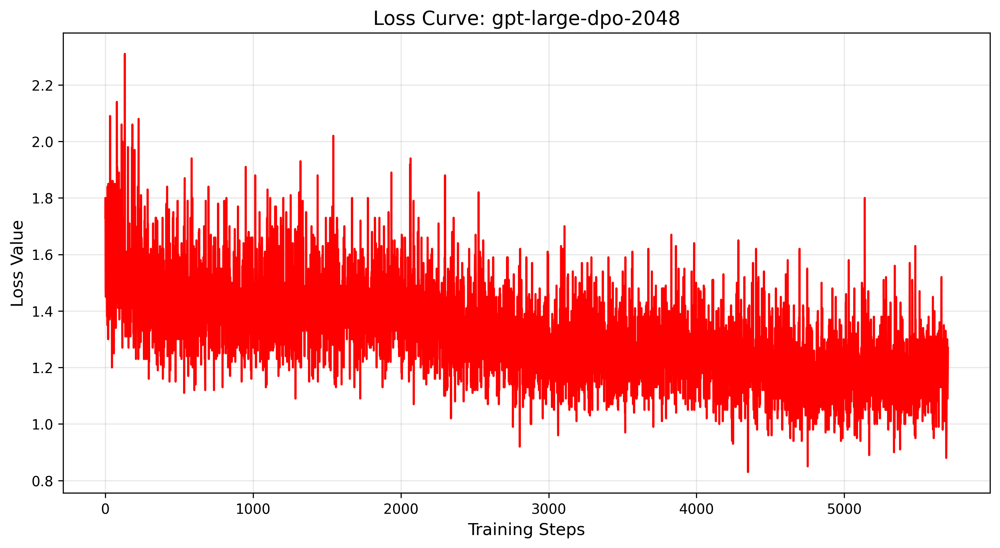

### Training

- **This guide demonstrates training procedures for 350 million parameter transformer models.**
- **Note: All commands below must be executed from the project root directory.(i.e., the directory containing the mimixlm.py)**
- **Download the dataset. (Requires the Hugging Face Transformers library)**
  
  - sh examples/gpt_large/download_pretrain.sh
- **Initialize the model.**
  - sh examples/gpt_large/init_model.sh
- **Train BPE tokenizer.**
  - sh examples/gpt_large/train_bpe.sh
  - **This was tested with 256GB RAM. If memory is insufficient, reduce the '--max_train_bpe_lines' parameter.**
- **Pretrain Stage**
  - **Preprocess the dataset.**
    - sh examples/gpt_large/preprocess.sh
  - **Train the model.**
    - sh examples/gpt_large/pretrain.sh
    - **This configuration uses 8 x NVIDIA A800 80GB GPU. If you encounter VRAM limitations, consider reducing the '--batch_size' parameter.**
- **Pretrain Stage 2 (extend the model max length to 2048)**
  - **Download the dataset.**
    - sh examples/gpt_large/download_pretrain_2048.sh
  - **Preprocess the dataset.**
    - sh examples/gpt_large/preprocess.sh
  - **Train the model.**
    - sh examples/gpt_large/pretrain.sh
    - **This configuration uses 8 x NVIDIA A800 80GB GPU. If you encounter VRAM limitations, consider reducing the '--batch_size' parameter.**
- **SFT Stage**
  - **Download the dataset.**
    
    - sh examples/gpt_large/download_sft.sh
  - **Preprocess the dataset.**
    - **Standardizing data formats across sources**: python examples/gpt_large/merge.py
    - sh examples/gpt_large/preprocess.sh
  - **Train the model.**
    - sh examples/gpt_large/pretrain.sh
    - **This configuration uses 8 x NVIDIA A800 80GB GPU. If you encounter VRAM limitations, consider reducing the '--batch_size' parameter.**
    
    - **Note: After training completes, change generation_mode from 'raw' to 'chat' in the configuration file(ie., model_config.json) for inference.**
- **DPO Stage**
  - **Download the dataset.**
    - sh examples/gpt_large/download_dpo.sh
  - **Preprocess the dataset.**
    - sh examples/gpt_large/preprocess_dpo.sh
  - **Train the model.**
    - sh examples/gpt_large/dpo.sh
    - **This configuration uses an NVIDIA A800 80GB GPU. If you encounter VRAM limitations, consider reducing the '--batch_size' parameter.**
- **Eval the ppl.**
  
  - sh examples/gpt_large/eval_ppl.sh
- **Run inference.**
  
  - python mimixlm.py --model_path model/gpt_large

### Result

- **Loss Curve**
  
  - **Pretrain Stage**
    - 
  - **Pretrain Stage 2**
    - 
  - **SFT Stage**
    - 
  - **DPO Stage**
    - 
  
- **More chat examples**
  
  - 
  
  - 