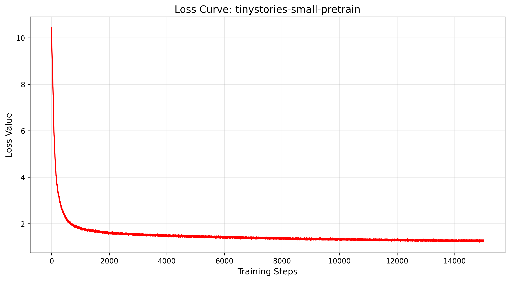

### Training

- **This guide demonstrates training procedures for 30 million parameter transformer models.**
- **Note: All commands below must be executed from the project root directory.(i.e., the directory containing the mimixlm.py)**
- **Download the dataset. (Requires the Hugging Face Transformers library)**
  - sh examples/tinystories/download_tinystories.sh  
- **Initialize the model.**
  - sh examples/tinystories/init_model.sh
- **Train BPE tokenizer.**
  - sh examples/tinystories/train_bpe.sh
  - **This was tested with 256GB RAM. If memory is insufficient, reduce the '--max_train_bpe_lines' parameter.**
- **Preprocess the dataset.**
  - sh examples/tinystories/preprocess.sh
- **Pretrain the model.**
  - sh examples/tinystories/pretrain.sh
  - **This configuration uses an NVIDIA A800 80GB GPU. If you encounter VRAM limitations, consider reducing the '--batch_size' parameter.**
- **Evaluate the ppl.**
  - sh examples/tinystories/eval_ppl.sh
- **Run inference.**
  - python mimixlm.py --model_path model/tinystories

### Result

- **Loss Curve**
  
  - 
- **PPL evaluation**
  
  - PPL: 3.7
  
- **Generated samples**

  - ```
    Once upon a time, there was a little girl named Lily. She loved to play in her backyard. One day, she saw a butterfly and ran after it. She chased the butterfly across the garden and into the woods.
    
    As she walked, she saw a little rabbit. The rabbit was crying because it was lost. Lily felt sad for the rabbit and wanted to help. She gently picked up the rabbit and took it back to its home in the woods.
    
    Lily's mom saw what she did and was very proud of her. She told Lily that she should always be kind to animals and to listen to them. Lily felt happy that she could help the rabbit and make it feel better. From that day on, Lily made sure to always be kind to animals and listen to their hearts.
    ```

    

