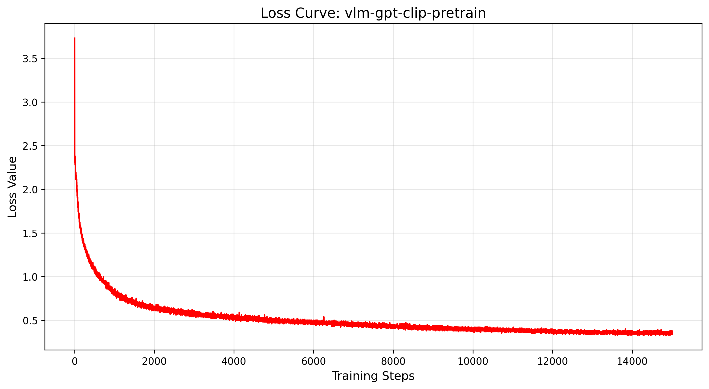
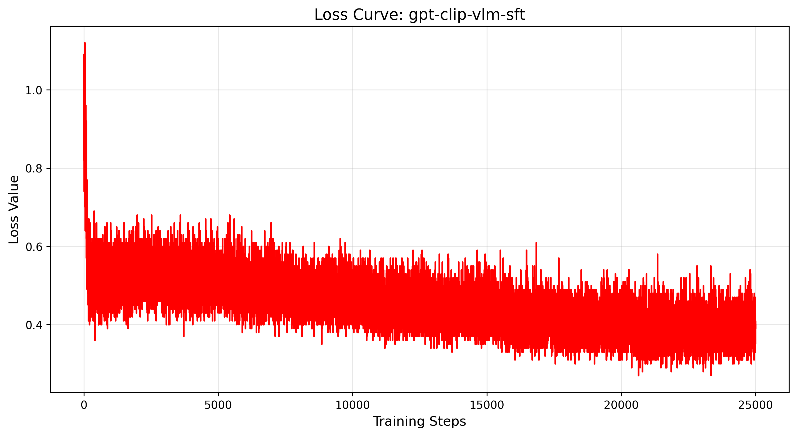

### Training

- **Note: All commands below must be executed from the project root directory.(i.e., the directory containing the mimixlm.py)**
- **Initialize the model (Requires the Hugging Face Transformers library)**
  - In this step, we'll copy the  weights from [gpt large model](../gpt_large) and open source clip weights to our new model.
  - sh examples/vlm/init_model.sh
  - BPE tokenizer is  initialize when train the language model, so we can directly use it.
- **Pretrain Stage**
  - **Download the dataset. (Requires the Hugging Face Transformers library)**
    - sh examples/vlm/download_pretrain.sh  
  - **Preprocess the dataset.**
    - python examples/vlm/convert_LLaVA-ReCap-CC3M.py 
    - sh examples/vlm/preprocess.sh
  - **Pretrain the model.**
    - sh examples/vlm/pretrain.sh
    - **This configuration uses 8 x NVIDIA A800 80GB GPU. If you encounter VRAM limitations, consider reducing the '--batch_size' parameter.**
- **SFT Stage**
  - **Download the dataset. (Requires the Hugging Face Transformers library)**
    - sh examples/vlm/download_sft.sh  
  - **Preprocess the dataset.**
    - python examples/vlm/convert_LLaVA-NeXT-Data.py
    - sh examples/vlm/preprocess_sft.sh
  - **SFT the model.**
    - sh examples/vlm/sft.sh
    - **This configuration uses 8 x NVIDIA A800 80GB GPU. If you encounter VRAM limitations, consider reducing the '--batch_size' parameter.**
    - **Note: After training completes, change generation_mode from 'raw' to 'chat' in the configuration file(ie., model_config.json) for inference.**

### Result

- **Loss Curve**
  - **Pretrain**
    - 
  - **SFT**
    - 

