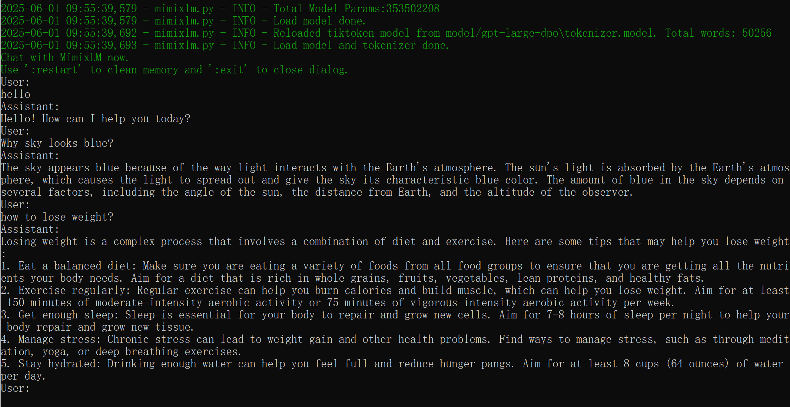
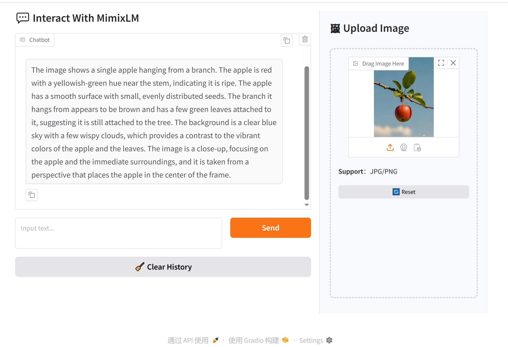

# MIMIXLM

Mimixlm is a single-file Python implementation of large language models (LLM) from scratch.

### Install

- **Basic installation** (inference only):  
  - pip install -r requirements.txt
- **Training installation** (optimal performance):  
  - pip install -r requirements-full.txt

### Quick Start

- **Download a trained 0.3B model to the "model" folder.** 
  - Download Link: https://drive.google.com/drive/folders/1auGTlSVbFgtDhSiVLDMmjXejWN8cKs3k?usp=sharing
- **Run the 'python  mimixlm.py --model_path <model_path> 'command, adding '--use_cuda' for GPU acceleration and ''--enable_gui' for graphical interface support as needed.** 
  - python  mimixlm.py --model_path <model_path>  *# CPU + CLI mode*  
  - python  mimixlm.py --model_path <model_path> --use_cuda  *# GPU + CLI mode*
  - python  mimixlm.py --model_path <model_path>  --enable_gui *# CPU + GUI mode*  
  - python  mimixlm.py --model_path <model_path>  --use_cuda --enable_gui *# GPU + GUI mode*    
- **Demo**
  - **CLI mode**
    - 
  - **GUI mode**
    - 

### Training

- A simple story generation model example demonstrating training on the TinyStories dataset. [Link](./examples/tinystories/readme.md)
- An implementation example showcasing the entire LLM training pipeline - including pre-training, instruction fine-tuning and human preference optimization. [Link](./examples/gpt_large/readme.md)
- A basic training example for an image captioning and visual question answering (VQA) model. [Link](./examples/vlm/readme.md)
- An example for converting the Llama3.2 1B Instruct Model for Compatibility with This Framework. [Link](./examples/convert_llama3/readme.md)

